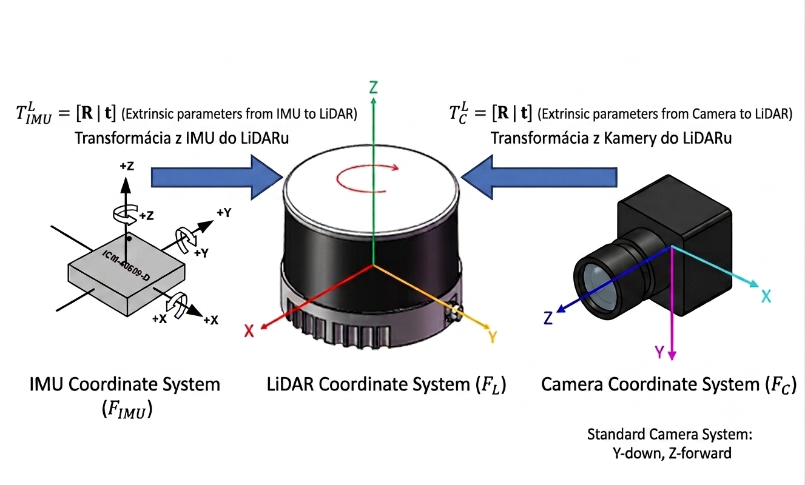

# TP-Hardware

Construction part of Hardware

# Fasteners \& Nuts — Sorted by Connection (Parts They Join)

|#|Fastener|Type|Qty|
|-|-|-|-|
|1|Countersunk Screw JIS B 1111 - M5x6 - H Steel 4.6 Plain|Screw|8|
|2|Countersunk Screw JIS B 1111 - M5x30 H Steel 4.6 Plain|Screw|4|
|3|Hexagon Nut DIN 934 - M5 x 0.8 Steel 6 Plain|Nut|8|
|4|Countersunk Screw JIS B 1111 - M5x20 H Steel 4.6 Plain|Screw|4|
|5|Hexagon Socket Head Cap Screw DIN 912 - M5 x 0.8 x 6 Steel 4.6 Plain|Screw|4|
|6|Hexagon Socket Head Cap Screw DIN 912 - M3 x 0.5 x 10 Steel 4.6 Plain|Screw|7|
|7|Hexagon Socket Head Cap Screw DIN 912 - M3 x 0.5 x 12 Steel 4.6 Plain|Screw|4|
|8|Hexagon Socket Head Cap Screw DIN 912 - M4 x 0.7 x 16 Steel 4.6 Plain|Screw|4|
|9|Hexagon Nut DIN 934 - M2.5 x 0.45|Nut|8|
|10|Stud Bolt DIN 976-1 - M2.5 x 85 - A|Stud|4|
|11|Stud DIN 938 - M3 x 30 Steel 4.6 Plain/M2.5|Stud|4|
|12|Hexagon Regular Nut DIN EN 24032 - M3 Steel 6 Plain|Nut|4|
|13|DIN 912 - M5 x 0.8 x 10 Steel 4.6 Plain|Screw|2|
|14|T-nut M5|Nut|8|


**Total fasteners: 73**

## Summary by Connection Zone

### Structural Frame (alu\_profile / alu\_profile\_Lko)

|Fastener|Type|Qty|Connects|
|-|-|-|-|
|Countersunk Screw JIS B 1111 - M5x6 |Screw|8|alu\_profile\_Lko ↔ alu\_profile via kamienok\_profile|

### Sensors Enclosure (sensors\_module\_bottom / sm\_wall\_back / sm\_wall\_front / sm\_wall\_back / sensors\_modul\_top)

|Fastener|Type|Qty|Connects|
|-|-|-|-|
|Hex Socket Cap Screw DIN 912 - M3x12 |Screw|4|sensors\_module\_bottom\_v2 ↔ sensors\_module\_top|
|Hex Socket Cap Screw DIN 912 - M3x10|Screw|4|PCB\_with\_IMU ↔ sensors\_modul\_top\_v3|
|Hex Socket Cap Screw DIN 912 - M3x10|Screw|3|camera ↔ sensors\_module\_bottom\_v2|
|Countersunk Screw JIS B 1111 - M5x20|Screw|4|sensors\_module\_bottom\_v2 ↔ alu\_profile\_Lko|
|Hex Nut DIN 934 - M5 x 0.8|Nut|4|With M5 screws above|
|Hex Socket Cap Screw DIN 912 - M4x16|Screw|4|LiDAR ↔ sensors\_module\_top|

### ACU / Jetson Case (acu\_jetson\_case)

|Fastener|Type|Qty|Connects|
|-|-|-|-|
|Countersunk Screw JIS B 1111 - M5x30|Screw|4|alu\_profile\_Lko ↔ acu\_jetson\_case|
|Hex Nut DIN 934 - M5 x 0.8|Nut|4|With M5 screws above|
|Stud Bolt DIN 976-1 - M2.5 x 85 - A|Stud|4|acu\_jetson\_case ↔ jetson\_agx\_orin\_model|
|Hexagon Nut DIN 934 - M2.5 x 0.45|Nut|8|acu\_jetson\_case & Stud above


### Handles

|Fastener|Type|Qty|Connects|
|-|-|-|-|
|Hex Socket Cap Screw DIN 912 - M5x6|Screw|4|handles ↔ alu\_profile|

### Jetson AGX Orin Sub-Assembly (jetson\_agx\_orin\_model)

|Fastener|Type|Qty|Connects|
|-|-|-|-|
|Stud DIN 938 - M3x30|Stud|4|jetson\_agx\_orin\_model ↔ stlpik (pillars)|
|Hex Regular Nut DIN EN 24032 - M3|Nut|4|Pairs with M3 studs → stlpik retention|
|Pillar Hex - M2.5 |Pillar|4x20mm, 4x10mm|jetson\_agx\_orin\_model|
|Pillar Round - M2.5 |Pillar|4x10mm, 4x5mm|jetson\_agx\_orin\_model|

### LiDAR connection box

|Fastener|Type|Qty|Connects|
|-|-|-|-|
|DIN 912 - M5 x 0.8 x 10 Steel 4.6 Plain|Screw|2|connection\_box ↔ sensors\_module\_top|

# Extrinsic sensor calibrations
> This is old calibration for breadboard prototype without PCB <br> extrinsic_T = [0., 0., -0.06954819845] - translation IMU to LiDAR frame [x, y, z] <br> extrinsic_R = [-1., 0., 0., 0., 1., 0., 0., 0., -1] - rotation IMU to LiDAR frame


$extrinsic_R$ (rotation IMU to LiDAR frame) = 
$$
\begin{bmatrix}
-1 & 0 & 0 \\
0 & 1 & 0 \\
0 & 0 & -1
\end{bmatrix}
$$ 
$extrinsic_T$ (translation IMU to LiDAR frame) = 
$$
\begin{bmatrix}
0 \\
0 \\
-0.06955
\end{bmatrix}
$$

$Rcl$ (rotation camera to LiDAR frame) = 
$$
\begin{bmatrix}
-1 & 0 & 0 \\
0 & 0 & -1 \\
0 & -1 & 0
\end{bmatrix}
$$ 
$Pcl$ (translation camera to LiDAR frame) = 
$$
\begin{bmatrix}
0 \\
0.09590 \\
-0.003819
\end{bmatrix}
$$



# Full assembly

## Construction parts:
- ```acu_jetson_case``` - module for jetson and battery
- ```handles``` - handles for easy grip
- ```alu_profile``` - supporting part of the entire structure
- ```alu_profile_Lko``` - L bracket
- ```sensors_module_bottom``` - bottom part of the sensor module
- ```sensors_module_top``` - top part of the sensor module
- ```sm_wall_side``` x2, ```sm_wall_back```, ```sm_wall_front``` - sensor module walls with aesthetic function
- ```alu_profile2``` x2 - sensor module stand

## Electrical components:
- LiDAR Hesai XT16
- IMU ICM-40609-D
- Camera Basler a2A 1920 - 160uc PRO with 6 mm C-mount lens
- Jetson AGX Orin 64GB Developer Kit
- Acu Amewi Li-Pol 5500mAh/14,8V
- STM32 F103 Bluepill
- TTL/RS232 converter

> All technical drawings are in /technical_drawings subfolder

