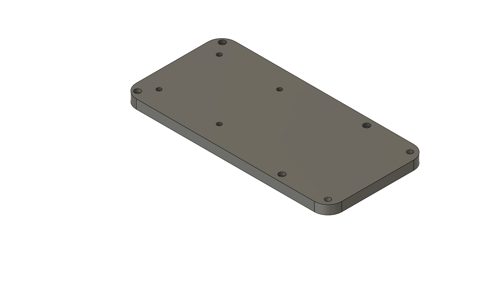
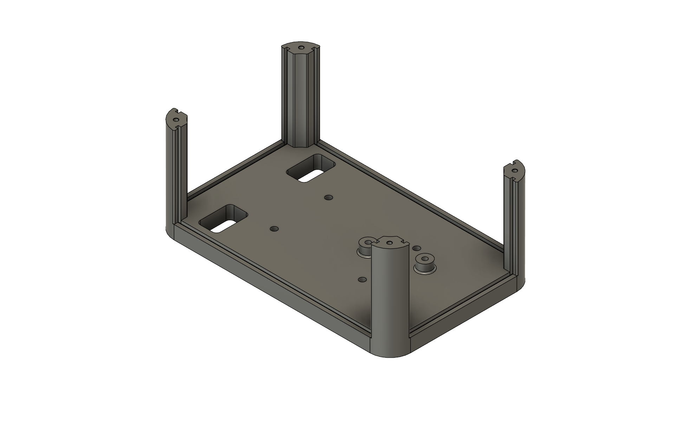
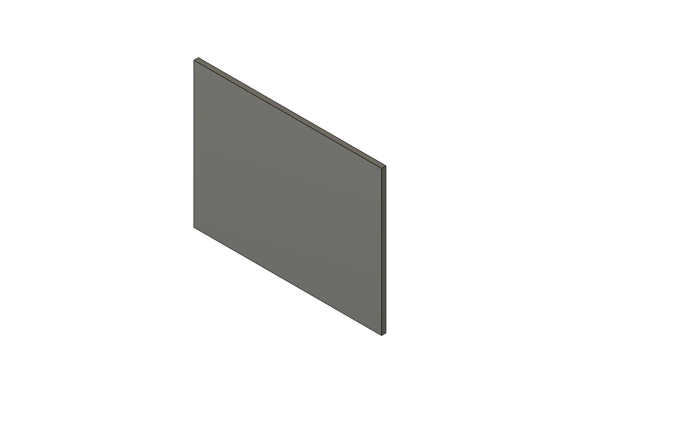
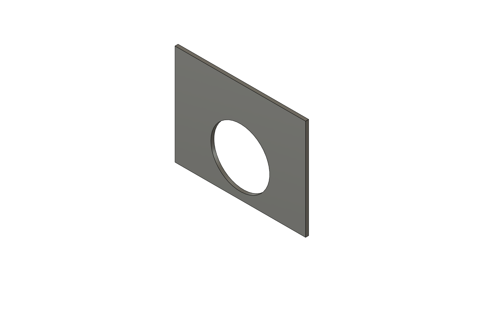
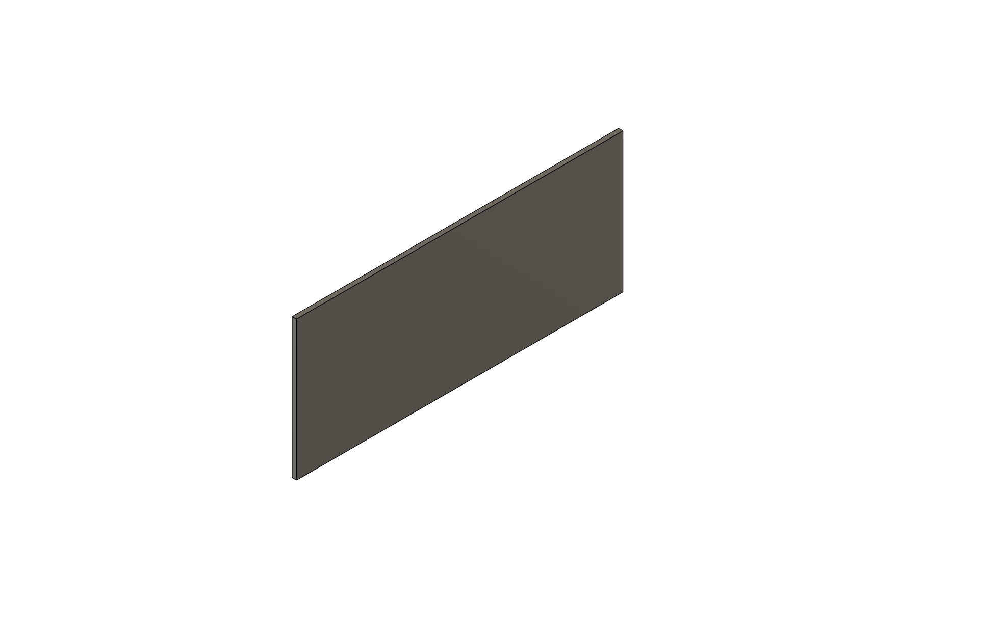
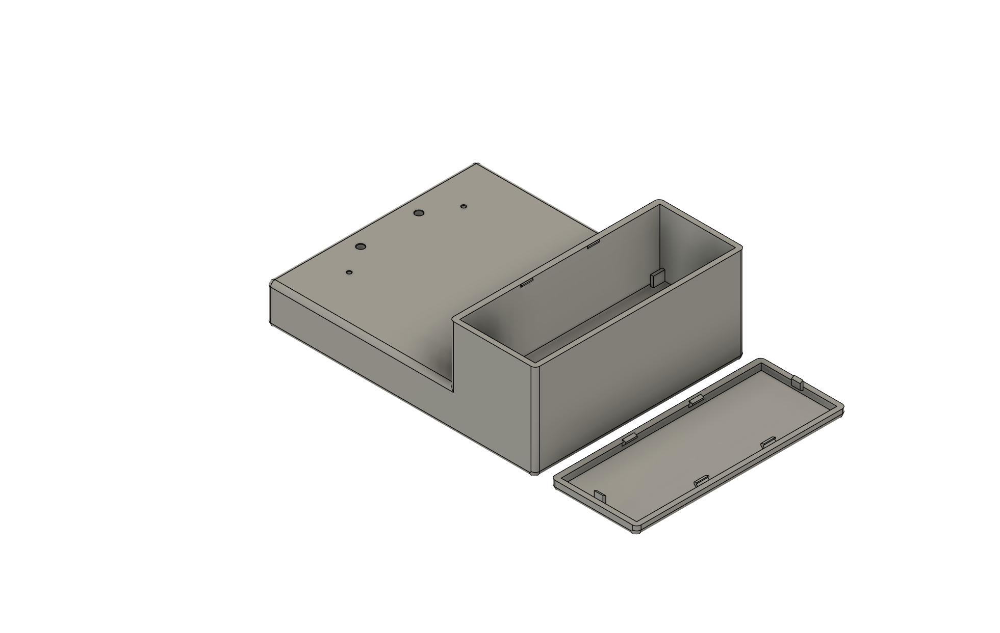
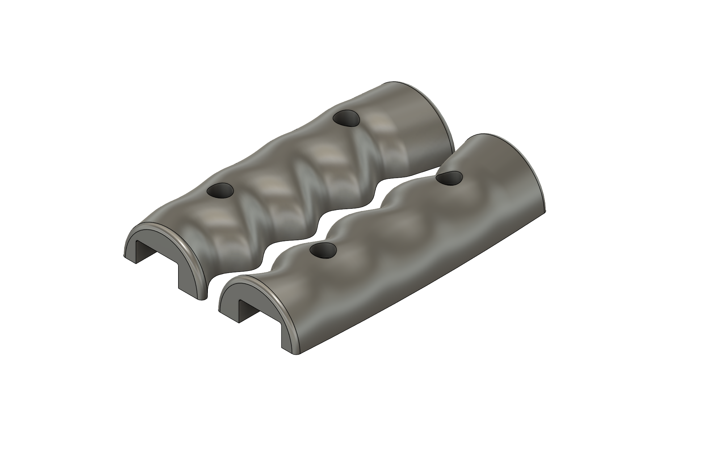
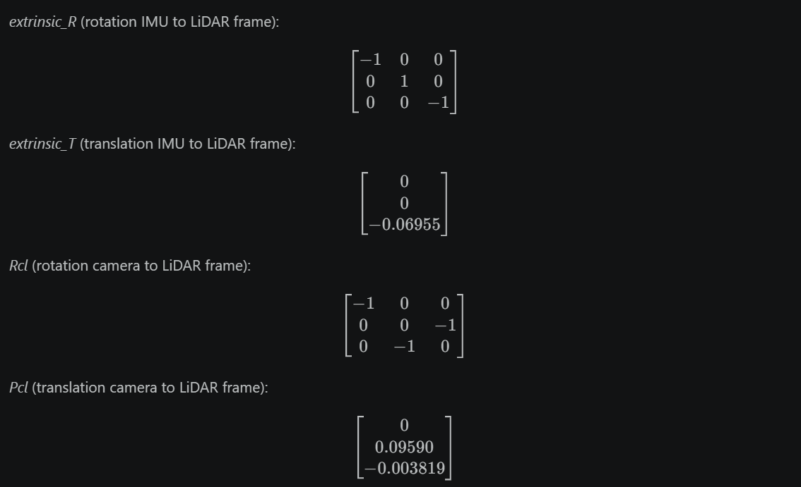
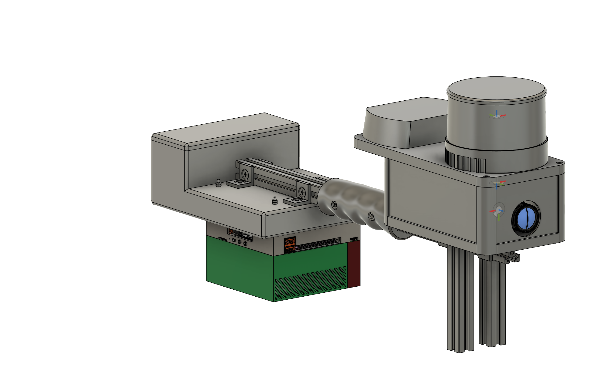

# TP-Hardware

[Repo link](https://github.com/STU-FEI-TP26-FAST-LIVO2/Hardware-Mechanical)

> SK Verzia

Mechanická časť hardvéru<br>
[Datasheets](parameters_datasheets/)<br>
[.step súbory](printable/step/)<br>
[.stl súbory](printable/stl/)<br>
[Technické výkresy](technical_drawings/)<br>

# 3D modely konštrukčných dielov

Kompletný zoznam konštrukčných častí je uvedený nižšie. Príslušné technické výkresy sú pripojené ku každému komponentu.
Všetky rozmery potrebné k návrhu konštrukčných dielov boli prevzaté z údajových listov jednotlivých komponentov, ktoré sú uložené [tu](parameters_datasheets/).
[LiDAR](https://www.hesaitech.com/wp-content/uploads/2025/04/PandarXT-16_User_Manual_X02-en-250410.pdf)
[Kamera](https://docs.baslerweb.com/a2a1920-160ucpro)
[IMU](https://product.tdk.com/system/files/dam/doc/product/sensor/mortion-inertial/imu/data_sheet/ds-000330_icm-40609-d_v1.2.pdf)
[Jetson download center](https://developer.nvidia.com/embedded/downloads#?tx=$product,jetson_agx_orin)

## sensors_module_top

[Technický výkres](technical_drawings/sensors_modul_top_drawing.pdf)



## sensors_module_bottom

[Technický výkres](technical_drawings/sensors_module_bottom_drawing.pdf)



## sm_wall_back

[Technický výkres](technical_drawings/sm_wall_back_drawing.pdf)



## sm_wall_front

[Technický výkres](technical_drawings/sm_wall_front_drawing.pdf)



## sm_wall_side

[Technický výkres](technical_drawings/sm_wall_side_drawing.pdf)



## acu_jetson_case

[Technický výkres](technical_drawings/acu_jetson_case_drawing.pdf)



## handles

[Technický výkres](technical_drawings/handles_drawing.pdf)



# Spojovací materiál — Zoznam

| #  | Spojovací materiál                                                                       | Typ     | Počet |
| -- | ---------------------------------------------------------------------------------------- | ------- | ----- |
| 1  | Zápustná skrutka JIS B 1111 - M5x6 - H Steel 4.6 Plain                                   | Skrutka | 8     |
| 2  | Zápustná skrutka JIS B 1111 - M5x30 H Steel 4.6 Plain                                    | Skrutka | 4     |
| 3  | Šesťhranná matica DIN 934 - M5 x 0.8 Steel 6 Plain                                       | Matica  | 8     |
| 4  | Zápustná skrutka JIS B 1111 - M5x20 H Steel 4.6 Plain                                    | Skrutka | 4     |
| 5  | Skrutka s valcovou hlavou a vnútorným šesťhranom DIN 912 - M5 x 0.8 x 6 Steel 4.6 Plain  | Skrutka | 4     |
| 6  | Skrutka s valcovou hlavou a vnútorným šesťhranom DIN 912 - M3 x 0.5 x 10 Steel 4.6 Plain | Skrutka | 7     |
| 7  | Skrutka s valcovou hlavou a vnútorným šesťhranom DIN 912 - M3 x 0.5 x 12 Steel 4.6 Plain | Skrutka | 4     |
| 8  | Skrutka s valcovou hlavou a vnútorným šesťhranom DIN 912 - M4 x 0.7 x 16 Steel 4.6 Plain | Skrutka | 4     |
| 9  | Šesťhranná matica DIN 934 - M2.5 x 0.45                                                  | Matica  | 8     |
| 10 | Závitová tyč DIN 976-1 - M2.5 x 85 - A                                                   | Stĺpik  | 4     |
| 11 | Závitový čap DIN 938 - M3 x 30 Steel 4.6 Plain/M2.5                                      | Stĺpik  | 4     |
| 12 | Šesťhranná matica DIN EN 24032 - M3 Steel 6 Plain                                        | Matica  | 4     |
| 13 | DIN 912 - M5 x 0.8 x 10 Steel 4.6 Plain                                                  | Skrutka | 2     |
| 14 | T-matica M5                                                                              | Matica  | 8     |

**Celkový počet spojovacích prvkov: 73**

## Súhrn podľa častí, ktoré sú spojené

### Nosná konštrukcia (alu_profile / alu_profile_Lko)

| Spojovací materiál                 | Typ     | Počet | Spája                                              |
| ---------------------------------- | ------- | ----- | -------------------------------------------------- |
| Zápustná skrutka JIS B 1111 - M5x6 | Skrutka | 8     | alu_profile_Lko ↔ alu_profile cez kamienok_profile |

### Senzorový modul (sensors_module_bottom / sm_wall_back / sm_wall_front / sm_wall_back / sensors_modul_top)

| Spojovací materiál                             | Typ     | Počet | Spája                                         |
| ---------------------------------------------- | ------- | ----- | --------------------------------------------- |
| Skrutka s vnútorným šesťhranom DIN 912 - M3x12 | Skrutka | 4     | sensors_module_bottom_v2 ↔ sensors_module_top |
| Skrutka s vnútorným šesťhranom DIN 912 - M3x10 | Skrutka | 4     | PCB_with_IMU ↔ sensors_modul_top_v3           |
| Skrutka s vnútorným šesťhranom DIN 912 - M3x10 | Skrutka | 3     | camera ↔ sensors_module_bottom_v2             |
| Zápustná skrutka JIS B 1111 - M5x20            | Skrutka | 4     | sensors_module_bottom_v2 ↔ alu_profile_Lko    |
| Šesťhranná matica DIN 934 - M5 x 0.8           | Matica  | 4     | Použité s vyššie uvedenými M5 skrutkami       |
| Skrutka s vnútorným šesťhranom DIN 912 - M4x16 | Skrutka | 4     | LiDAR ↔ sensors_module_top                    |

### Baterka / Jetson modul (acu_jetson_case)

| Spojovací materiál                      | Typ     | Počet | Spája                                    |
| --------------------------------------- | ------- | ----- | ---------------------------------------- |
| Zápustná skrutka JIS B 1111 - M5x30     | Skrutka | 4     | alu_profile_Lko ↔ acu_jetson_case        |
| Šesťhranná matica DIN 934 - M5 x 0.8    | Matica  | 4     | Použité s vyššie uvedenými M5 skrutkami  |
| Závitová tyč DIN 976-1 - M2.5 x 85 - A  | Stĺpik  | 4     | acu_jetson_case ↔ jetson_agx_orin_model  |
| Šesťhranná matica DIN 934 - M2.5 x 0.45 | Matica  | 8     | acu_jetson_case & vyššie uvedené stĺpiky |

### Rukoväte

| Spojovací materiál                            | Typ     | Počet | Spája                 |
| --------------------------------------------- | ------- | ----- | --------------------- |
| Skrutka s vnútorným šesťhranom DIN 912 - M5x6 | Skrutka | 4     | handles ↔ alu_profile |

### Jetson AGX Orin Podzostava (jetson_agx_orin_model)

| Spojovací materiál                  | Typ    | Počet | Spája                                      |
| ----------------------------------- | ------ | ----- | ------------------------------------------ |
| Závitový čap DIN 938 - M3x30        | Stĺpik | 4     | jetson_agx_orin_model ↔ stlpik (stĺpiky)   |
| Šesťhranná matica DIN EN 24032 - M3 | Matica | 4     | Párované s M3 stĺpikmi → uchytenie stĺpika |

### Komunikačné rozhranie LiDARu

| Spojovací materiál                      | Typ     | Počet | Spája                               |
| --------------------------------------- | ------- | ----- | ----------------------------------- |
| DIN 912 - M5 x 0.8 x 10 Steel 4.6 Plain | Skrutka | 2     | connection_box ↔ sensors_module_top |

# Extrinzické kalibrácie senzorov




# Kompletná Zostava

## Konštrukčné časti:

* `acu_jetson_case` - modul pre Jetson a batériu
* `handles` - rukoväte pre jednoduché uchopenie
* `alu_profile` - nosná časť celej konštrukcie
* `alu_profile_Lko` - L držiak
* `sensors_module_bottom` - spodná časť senzorového modulu
* `sensors_module_top` - horná časť senzorového modulu
* `sm_wall_side` x2, `sm_wall_back`, `sm_wall_front` - steny senzorového modulu s estetickou funkciou
* `alu_profile2` x2 - stojan senzorového modulu

## Elektrické komponenty:

* LiDAR Hesai XT16
* IMU ICM-40609-D
* Kamera Basler a2A 1920 - 160uc PRO so 6 mm C-mount objektívom
* Jetson AGX Orin 64GB Developer Kit
* Acu Amewi Li-Pol 5500mAh/14,8V
* STM32 F103 Bluepill
* TTL/RS232 prevodník

## Izometrický pohľad kompletnej zostavy



> EN Version

Mechanical part of Hardware<br>
[Datasheets](parameters_datasheets/)<br>
[.step files](printable/step/)<br>
[.stl files](printable/stl/)<br>
[Technical drawings](technical_drawings/)<br>

# 3D Models of Construction Parts

Full listing of construction parts below. The relevant technical drawings are linked to each component.
All dimensions required for the design of structural parts were taken from the datasheets of the individual components, which are stored [here](parameters_datasheets/)
[LiDAR](https://www.hesaitech.com/wp-content/uploads/2025/04/PandarXT-16_User_Manual_X02-en-250410.pdf)
[Kamera](https://docs.baslerweb.com/a2a1920-160ucpro)
[IMU](https://product.tdk.com/system/files/dam/doc/product/sensor/mortion-inertial/imu/data_sheet/ds-000330_icm-40609-d_v1.2.pdf)
[Jetson download center](https://developer.nvidia.com/embedded/downloads#?tx=$product,jetson_agx_orin)

## sensors_module_top

[Technical drawing](technical_drawings/sensors_modul_top_drawing.pdf)


## sensors_module_bottom

[Technical drawing](technical_drawings/sensors_module_bottom_drawing.pdf)


## sm_wall_back

[Technical drawing](technical_drawings/sm_wall_back_drawing.pdf)


## sm_wall_front

[Technical drawing](technical_drawings/sm_wall_front_drawing.pdf)


## sm_wall_side

[Technical drawing](technical_drawings/sm_wall_side_drawing.pdf)


## acu_jetson_case

[Technical drawing](technical_drawings/acu_jetson_case_drawing.pdf)


## handles

[Technical drawing](technical_drawings/handles_drawing.pdf)


# Fasteners \& Nuts — Sorted by Connection (Parts They Join)

|#|Fastener|Type|Qty|
|-|-|-|-|
|1|Countersunk Screw JIS B 1111 - M5x6 - H Steel 4.6 Plain|Screw|8|
|2|Countersunk Screw JIS B 1111 - M5x30 H Steel 4.6 Plain|Screw|4|
|3|Hexagon Nut DIN 934 - M5 x 0.8 Steel 6 Plain|Nut|8|
|4|Countersunk Screw JIS B 1111 - M5x20 H Steel 4.6 Plain|Screw|4|
|5|Hexagon Socket Head Cap Screw DIN 912 - M5 x 0.8 x 6 Steel 4.6 Plain|Screw|4|
|6|Hexagon Socket Head Cap Screw DIN 912 - M3 x 0.5 x 10 Steel 4.6 Plain|Screw|7|
|7|Hexagon Socket Head Cap Screw DIN 912 - M3 x 0.5 x 12 Steel 4.6 Plain|Screw|4|
|8|Hexagon Socket Head Cap Screw DIN 912 - M4 x 0.7 x 16 Steel 4.6 Plain|Screw|4|
|9|Hexagon Nut DIN 934 - M2.5 x 0.45|Nut|8|
|10|Stud Bolt DIN 976-1 - M2.5 x 85 - A|Stud|4|
|11|Stud DIN 938 - M3 x 30 Steel 4.6 Plain/M2.5|Stud|4|
|12|Hexagon Regular Nut DIN EN 24032 - M3 Steel 6 Plain|Nut|4|
|13|DIN 912 - M5 x 0.8 x 10 Steel 4.6 Plain|Screw|2|
|14|T-nut M5|Nut|8|


**Total fasteners: 73**

## Summary by Connection Zone

### Structural Frame (alu\_profile / alu\_profile\_Lko)

|Fastener|Type|Qty|Connects|
|-|-|-|-|
|Countersunk Screw JIS B 1111 - M5x6 |Screw|8|alu\_profile\_Lko ↔ alu\_profile via kamienok\_profile|

### Sensors Enclosure (sensors\_module\_bottom / sm\_wall\_back / sm\_wall\_front / sm\_wall\_back / sensors\_modul\_top)

|Fastener|Type|Qty|Connects|
|-|-|-|-|
|Hex Socket Cap Screw DIN 912 - M3x12 |Screw|4|sensors\_module\_bottom\_v2 ↔ sensors\_module\_top|
|Hex Socket Cap Screw DIN 912 - M3x10|Screw|4|PCB\_with\_IMU ↔ sensors\_modul\_top\_v3|
|Hex Socket Cap Screw DIN 912 - M3x10|Screw|3|camera ↔ sensors\_module\_bottom\_v2|
|Countersunk Screw JIS B 1111 - M5x20|Screw|4|sensors\_module\_bottom\_v2 ↔ alu\_profile\_Lko|
|Hex Nut DIN 934 - M5 x 0.8|Nut|4|With M5 screws above|
|Hex Socket Cap Screw DIN 912 - M4x16|Screw|4|LiDAR ↔ sensors\_module\_top|

### ACU / Jetson Case (acu\_jetson\_case)

|Fastener|Type|Qty|Connects|
|-|-|-|-|
|Countersunk Screw JIS B 1111 - M5x30|Screw|4|alu\_profile\_Lko ↔ acu\_jetson\_case|
|Hex Nut DIN 934 - M5 x 0.8|Nut|4|With M5 screws above|
|Stud Bolt DIN 976-1 - M2.5 x 85 - A|Stud|4|acu\_jetson\_case ↔ jetson\_agx\_orin\_model|
|Hexagon Nut DIN 934 - M2.5 x 0.45|Nut|8|acu\_jetson\_case & Stud above


### Handles

|Fastener|Type|Qty|Connects|
|-|-|-|-|
|Hex Socket Cap Screw DIN 912 - M5x6|Screw|4|handles ↔ alu\_profile|

### Jetson AGX Orin Sub-Assembly (jetson\_agx\_orin\_model)

|Fastener|Type|Qty|Connects|
|-|-|-|-|
|Stud DIN 938 - M3x30|Stud|4|jetson\_agx\_orin\_model ↔ stlpik (pillars)|
|Hex Regular Nut DIN EN 24032 - M3|Nut|4|Pairs with M3 studs → stlpik retention|

### LiDAR connection box

|Fastener|Type|Qty|Connects|
|-|-|-|-|
|DIN 912 - M5 x 0.8 x 10 Steel 4.6 Plain|Screw|2|connection\_box ↔ sensors\_module\_top|

# Extrinsic sensor calibrations


# Full assembly

## Construction parts:
- ```acu_jetson_case``` - module for jetson and battery
- ```handles``` - handles for easy grip
- ```alu_profile``` - supporting part of the entire structure
- ```alu_profile_Lko``` - L bracket
- ```sensors_module_bottom``` - bottom part of the sensor module
- ```sensors_module_top``` - top part of the sensor module
- ```sm_wall_side``` x2, ```sm_wall_back```, ```sm_wall_front``` - sensor module walls with aesthetic function
- ```alu_profile2``` x2 - sensor module stand

## Electrical components:
- LiDAR Hesai XT16
- IMU ICM-40609-D
- Camera Basler a2A 1920 - 160uc PRO with 6 mm C-mount lens
- Jetson AGX Orin 64GB Developer Kit
- Acu Amewi Li-Pol 5500mAh/14,8V
- STM32 F103 Bluepill
- TTL/RS232 converter

## Full assembly isometric view


